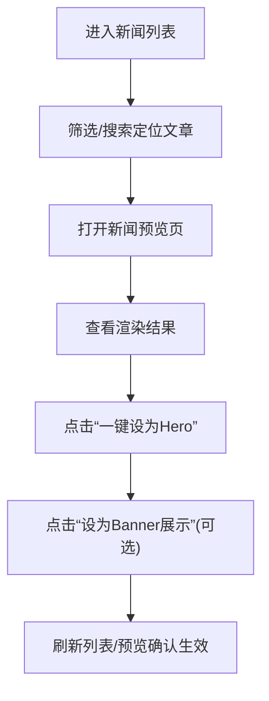
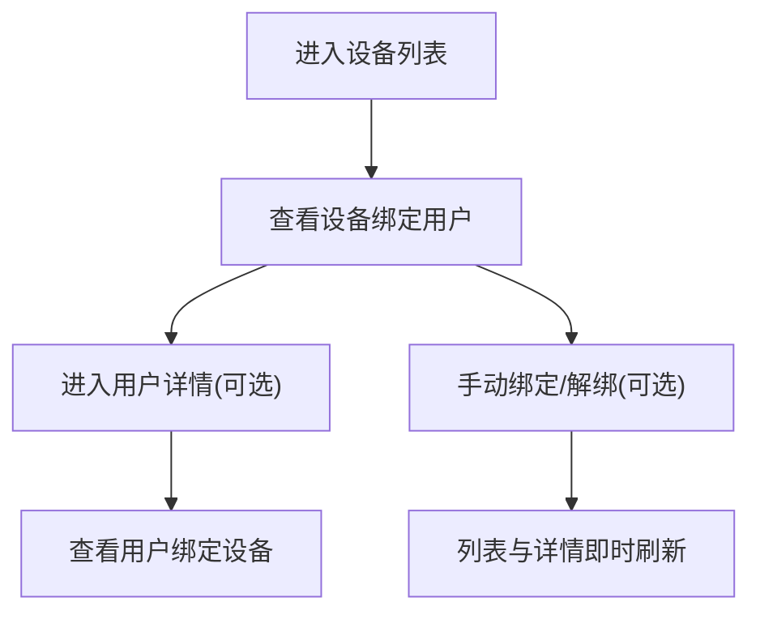

## 1. 产品概述
一个免登录的内部管理后台（桌面优先），用于管理爬取到的小程序新闻、固件设备（设备启动上报）与小程序用户，并支持设备与用户设备绑定关系的查看与维护。

## 2. 核心功能

### 2.1 用户角色
本后台默认免登录（适用于内网/本地自用）。为避免误操作，可提供“可选的管理口令（Token）”开关（不影响免登录体验，仅作为访问控制）。

### 2.2 功能模块
1. **概览**：今日数据概览、最近入库新闻、最近活跃设备、最近新增用户。
2. **新闻管理**：新闻列表、筛选搜索、详情预览（渲染页面）、一键设置为 Hero / Banner、置顶/取消置顶（可选）。
3. **设备管理**：固件设备列表（boot reports）、设备详情、查看绑定用户、手动绑定/解绑到用户（可选）。
4. **用户管理**：小程序用户列表、用户详情、查看绑定设备、从用户侧绑定/解绑设备（可选）。
5. **系统设置**：API Base、可选 Token（用于调用需要 Token 的接口）、显示时区（默认 Asia/Shanghai）。

### 2.3 页面与模块明细
| 页面名称 | 模块名称 | 功能说明 |
|---|---|---|
| / | 概览卡片 | 新闻总量/今日新增、设备总量/近7天活跃、用户总量/今日新增等 |
| /news | 列表与筛选 | 分页、按 pinned/type_code/layout_code/tag/q/since 筛选；支持快速打开预览 |
| /news/:id | 预览与动作区 | 展示标题/摘要/封面/来源/时间；渲染 content（PLAIN 或 RICH_TEXT_NODES）；一键设置为 HERO；一键设置 HERO 展示为 BANNER；取消 HERO；（可选）设置 pinned |
| /devices | 设备列表 | 展示 device_id、board_type、fw_user_agent、first_seen_at、last_seen_at；显示当前绑定用户（如有） |
| /devices/:id | 设备详情 | 展示设备上报字段；显示绑定用户信息；可手动绑定/解绑（可选） |
| /users | 用户列表 | 展示 id/openid/unionid/nick_name/avatar_url、创建/更新时间；显示绑定设备（如有） |
| /users/:id | 用户详情 | 展示用户资料；显示绑定设备；可手动绑定/解绑（可选） |
| /settings | 连接设置 | 配置 API Base、可选 Token、本地时区/显示偏好 |

## 3. 核心流程

### 3.1 新闻设置为 Hero/Banner
管理员在新闻列表中选中某条新闻，进入预览页确认渲染效果，然后一键将该新闻设置为 Hero（并可选择展示为 Banner）。

### 3.2 设备与用户关联
管理员从“设备”或“用户”任一入口查看绑定关系，并（可选）进行绑定/解绑。

## 4. 用户界面设计

### 4.1 设计风格
- 主题：深色仪表盘风格（赛车控制台感），高对比度信息层级清晰
- 主色：黑/深灰（背景） + F1 红（强调） + 冷白（文字）
- 字体：标题使用项目内 Formula1 字体（更具辨识度）；正文使用系统中文无衬线（例如 PingFang SC/Microsoft YaHei）
- 布局：左侧导航 + 顶部工具条 + 内容区域卡片化；关键操作固定在详情页右侧操作区
- 交互：表格筛选、快速搜索、抽屉/弹窗预览、危险操作二次确认

### 4.2 页面设计概览
| 页面名称 | 模块名称 | UI 元素 |
|---|---|---|
| /news | 列表 | 表格（列：tag/title/layout/type/pinned/published_at）、筛选条、快速预览按钮 |
| /news/:id | 预览 | 左侧文章信息卡 + 右侧“渲染预览”容器 + 右侧操作按钮（Hero/Banner/Pin） |
| /devices | 列表 | 表格（device_id/board/fw/last_seen/绑定用户）、点击行进详情 |
| /users | 列表 | 表格（id/openid/nick/绑定设备）、点击行进详情 |

### 4.3 响应式
桌面优先；在窄屏下导航折叠为抽屉，表格列可折叠/横向滚动。

