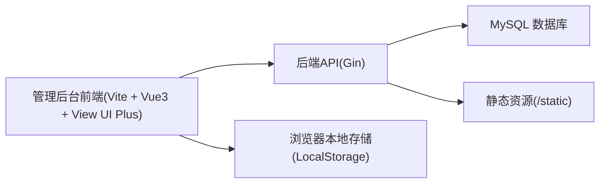
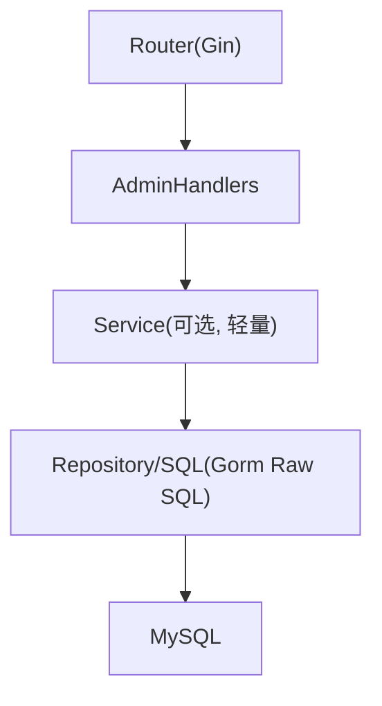
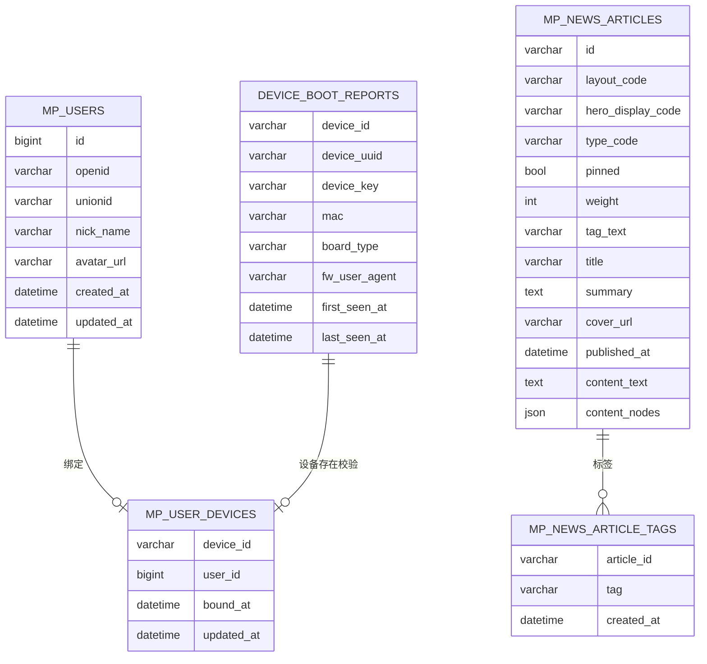

## 1. 架构设计

说明：
- 前端为独立 Vite 子项目，默认通过 `VITE_API_BASE` 指向后端（留空表示同域）。
- 若后端启用了入库/管理 Token（例如 NEWS_INGEST_TOKEN 或新增 ADMIN_TOKEN），前端在设置页配置并存入 LocalStorage，所有需要鉴权的请求自动携带 query token。

## 2. 技术说明
- 前端：Vue@3 + vue-router@4 + view-ui-plus（iView 的 Vue3 版本）+ Vite
- 请求：原生 fetch（与现有 charts 子项目保持一致）
- 状态：页面内组合式函数（composables）+ 路由参数；轻量存储用 LocalStorage
- 后端：复用现有 Gin 服务；新增少量 admin API（用户/设备列表与绑定维护）或复用现有接口拼装
- 数据库：复用现有 MySQL 表（mp_news_articles/mp_users/mp_user_devices/device_boot_reports 等）

## 3. 路由定义
| Route | 用途 |
|---|---|
| / | 概览 |
| /news | 新闻管理列表 |
| /news/:id | 新闻预览与一键设置 |
| /devices | 固件设备列表（boot reports） |
| /devices/:id | 设备详情与绑定关系 |
| /users | 小程序用户列表 |
| /users/:id | 用户详情与绑定关系 |
| /settings | API/Token/时区设置 |

## 4. API 定义

### 4.1 复用现有 API（无需新增后端也能工作的一部分）
- `GET /api/v1/mp/news`：新闻列表
- `GET /api/v1/mp/news/:id`：新闻详情（含 content）
- `POST /api/v1/mp/news/ingest?token=...`：复用入库接口实现“更新 layout_code/hero_display_code/pinned/weight”等（前端先拉取 detail，再回写同一篇文章）

### 4.2 建议新增的 Admin API（用于用户/设备列表与绑定维护）
若需要在后台中完整实现“固件设备/用户列表 + 关联/绑定维护”，建议新增以下接口（默认免登录；可选 query token 保护）：

#### 4.2.1 设备列表
- `GET /api/v1/admin/devices`
  - 返回：device_boot_reports 的分页列表 + 关联的 mp_user_devices.user_id（若有）

#### 4.2.2 设备详情
- `GET /api/v1/admin/devices/:device_id`
  - 返回：单个 boot report + 绑定用户信息（mp_users）

#### 4.2.3 用户列表
- `GET /api/v1/admin/mp/users`
  - 返回：mp_users 的分页列表 + 关联的 mp_user_devices.device_id（若有）

#### 4.2.4 绑定/解绑（可选）
- `POST /api/v1/admin/bind`
  - body: `{ "user_id": 123, "device_id": "xxx" }`
  - 行为：upsert 到 mp_user_devices（并校验 device_boot_reports 存在）
- `POST /api/v1/admin/unbind`
  - body: `{ "user_id": 123 }` 或 `{ "device_id": "xxx" }`

## 5. 服务端架构图（新增 Admin API 时）

## 6. 数据模型

### 6.1 ER 图（核心字段简化）

### 6.2 数据定义语言（仅说明，不在此文档生成迁移）
本项目已包含对应建表 SQL（见 backend/sql）。若新增 admin 相关表（通常不需要），再补充迁移文件。

