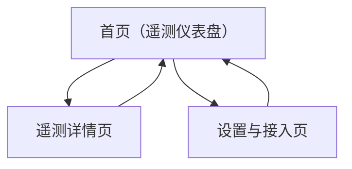

## 1. Product Overview
面向赛车遥测数据的微信小程序基础框架方案，支持用 ECharts 图表快速查看关键遥测趋势。
核心价值：用 TDesign 统一 UI 体验，沉淀可复用的“数据→图表→联动分析”页面模板。

## 2. Core Features

### 2.1 Feature Module
本小程序需求由以下主要页面组成：
1. **首页（遥测仪表盘）**：会话选择、关键指标卡片、图表预览、记录列表。
2. **遥测详情页**：多图联动分析、区间缩放、通道开关、数据异常提示。
3. **设置与接入页**：UI/图表基础配置、ECharts 适配检测、遥测数据接入说明入口。

### 2.2 Page Details
| Page Name | Module Name | Feature description |
|-----------|-------------|---------------------|
| 首页（遥测仪表盘） | 顶部导航与会话选择 | 选择车辆/赛道/会话（示例数据也可）；切换后刷新整页指标与图表预览。 |
| 首页（遥测仪表盘） | KPI 指标卡片 | 展示速度、转速、档位、油门、刹车、圈速等关键数值（最新点/均值/峰值三选一，固定一种即可）。 |
| 首页（遥测仪表盘） | 图表预览（ECharts） | 渲染 2–3 个核心预览图（如速度&转速、油门&刹车、圈速趋势）；点击进入详情页。 |
| 首页（遥测仪表盘） | 记录列表 | 展示可进入的会话/圈次列表（名称、时间、圈数、数据完整度）；支持下拉刷新（可选）。 |
| 遥测详情页 | 图表联动分析 | 同屏展示多张图（折线/面积/阶梯）；统一 X 轴（时间或距离）；tooltip 游标联动。 |
| 遥测详情页 | 区间缩放与定位 | 支持 dataZoom（滑块或手势）缩放；提供“回到全局”一键复位。 |
| 遥测详情页 | 通道开关与视图切换 | 选择显示通道（速度/转速/油门/刹车/档位/DRS 等，以数据实际包含为准）；切换不跳页。 |
| 遥测详情页 | 数据质量提示 | 当关键通道缺失/采样率异常时，展示 TDesign 空状态/提示文案。 |
| 设置与接入页 | 基础配置 | 切换主题模式（浅色/深色，默认浅色即可）；选择图表刷新策略（进入页刷新/实时刷新二选一）。 |
| 设置与接入页 | ECharts 运行检测 | 展示当前机型 canvas 能力与渲染结果（简单“测试图”）；失败给出排查指引。 |
| 设置与接入页 | 接入说明入口 | 展示“遥测数据格式约定/示例 JSON/字段说明”并可复制（仅文档展示，不做上传/登录）。 |

## 3. Core Process
- 浏览流程：你从首页选择一个遥测会话 → 看到关键指标与预览图 → 点击某个预览图或记录进入详情 → 在详情页缩放区间并开关通道进行对比分析 → 如遇到渲染/数据问题去设置页查看检测与接入说明。

