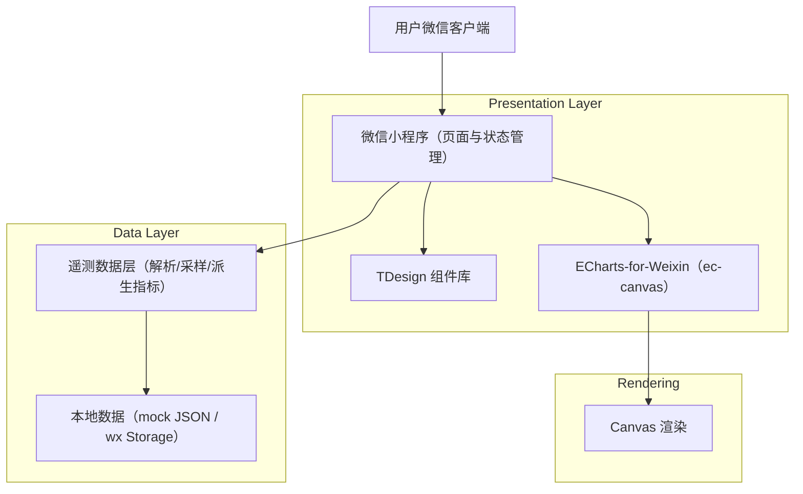
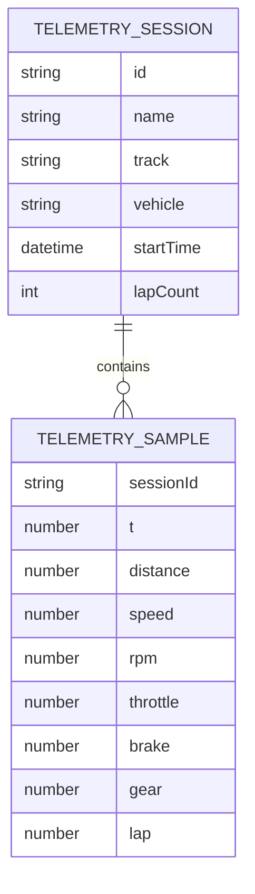

## 1.Architecture design

## 2.Technology Description
- Frontend: 微信小程序原生框架（建议 TypeScript） + TDesign Miniprogram
- Chart: echarts@5 + echarts-for-weixin（ec-canvas 组件）
- Backend: None（先以本地 mock/缓存数据跑通；后续如需云端存储再引入服务）

## 3.Route definitions
| Route | Purpose |
|-------|---------|
| /pages/home/index | 首页仪表盘：会话选择、KPI、图表预览、记录列表 |
| /pages/session-detail/index | 遥测详情：多图联动、缩放、通道开关 |
| /pages/settings/index | 设置与接入：主题/刷新策略、ECharts 检测、数据格式说明 |

## 4.Directory structure（建议）
> 以 `miniprogram/` 为小程序根目录（按你现有工程调整）。

- miniprogram/
  - app.ts / app.js
  - app.json（路由、window、tabBar 如需）
  - app.wxss（全局样式变量/主题）
  - pages/
    - home/
      - index.wxml
      - index.ts
      - index.wxss
      - index.json（按需引入 TDesign 组件）
    - session-detail/
      - index.wxml
      - index.ts
      - index.wxss
      - index.json
    - settings/
      - index.wxml
      - index.ts
      - index.wxss
      - index.json
  - components/
    - telemetry-kpi-card/（复用 KPI 卡）
    - telemetry-channel-switch/（通道开关面板）
    - ec-canvas/（从 echarts-for-weixin 拷贝或以 subpackage 引入）
  - services/
    - telemetryService.ts（读取/解析/采样/派生指标）
    - optionFactory.ts（生成 ECharts option：统一主题/配色/轴）
  - utils/
    - throttle.ts（缩放/滑动更新节流）
    - format.ts（单位、时间、数值格式化）
  - assets/
    - icons/（车辆/赛道图标）
    - mock/telemetry-session.json

## 5.Data model(if applicable)
### 5.1 Data model definition

### 5.2 Data Definition Language
> 本阶段不引入数据库；数据以 JSON 文件或 `wx.setStorage` 形式缓存。
- 建议 JSON 顶层：`{ session: {...}, samples: [...] }`
- 关键约定：`t`（秒）或 `distance`（米）至少其一存在，作为统一 X 轴。
