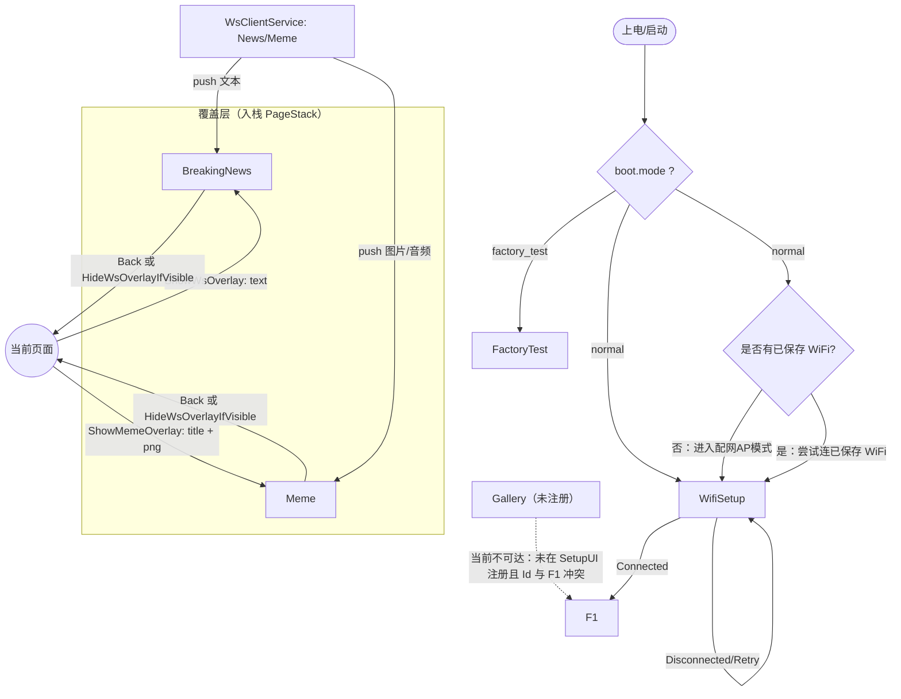
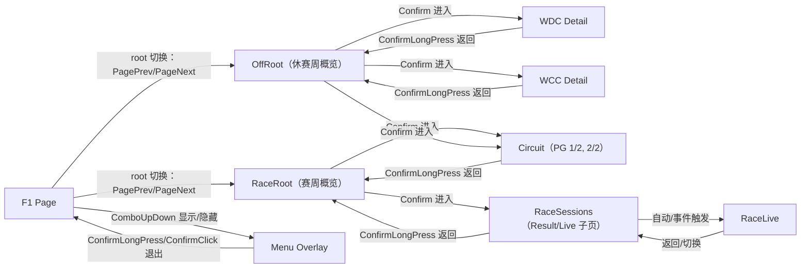

# UI Page ASCII 示意图（基于页面功能）

本文根据 `main/display/pages/*` 的 LVGL 布局代码整理，把当前固件里各个 Page 的功能和视觉分区用 ASCII 画出来，便于快速对齐 UI 结构与交互逻辑。

- 目标设备画布：`400 x 300`（来自 `EXAMPLE_LCD_WIDTH/HEIGHT`）
- 说明：ASCII 为“结构示意”，不保证像素级比例；但分区、控件类型与信息密度按代码真实布局归纳。

页面注册入口：`LcdDisplay::SetupUI()`：[lcd_display.cc](file:///c:/Users/GinTonic/Desktop/zectrix/main/display/lcd_display.cc#L421-L463)

## 0. 页面流转（Mermaid）





## 1. FactoryTest（工厂测试页）

功能：显示 7 步测试流程与当前步骤详情（RUN/PASS/FAIL/WAIT）。

代码位置：[factory_test_page_adapter.cc](file:///c:/Users/GinTonic/Desktop/zectrix/main/display/pages/factory_test_page_adapter.cc)

```text
+------------------------------------------------------------------------------+
| [FT测试]                                                        [1/7] [WAIT] |
|------------------------------------------------------------------------------|
| +--------------------+ +---------------------------------------------------+ |
| | RF             >   | | <title> 当前测试标题                               | |
| | 音频                | | <hint>  提示/引导文本                               | |
| | RTC                 | | <detail1> 细节 1                                   | |
| | 充电                | | <detail2> 细节 2                                   | |
| | LED                 | | <detail3> 细节 3                                   | |
| | 按键                | | <detail4> 细节 4                                   | |
| | NFC                 | |                                                   | |
| +--------------------+ +---------------------------------------------------+ |
| <footer> 底部提示（如：全部通过，请拔掉 USB 后按确认）                           |
+------------------------------------------------------------------------------+
```

## 2. WifiSetup（首次启动配网页）

功能：首次启动 WiFi 配置引导；上半屏显示引导图，下半屏显示 SSID/URL/步骤/状态。

代码位置：[wifi_setup_page_adapter.cc](file:///c:/Users/GinTonic/Desktop/zectrix/main/display/pages/wifi_setup_page_adapter.cc)

```text
+------------------------------------------------------------------------------+
|                                                                              |
| +---------------------------------- splash --------------------------------+ |
| |                                                                          | |
| |                 [ setup.bin / setup.png 引导图 ]                          | |
| |                                                                          | |
| |                (找不到资源时显示“Missing wifi/setup.*”)                   | |
| +--------------------------------------------------------------------------+ |
|                                                                              |
| [首次启动 - WiFi 配置]                                                       |
| SSID:   <ssid>                                                               |
| URL:    <url>                                                                |
| STEPS:  <steps>                                                              |
| STATUS: <status>                                                             |
+------------------------------------------------------------------------------+
```

## 3. F1（主信息页：多子视图 + 内部导航）

功能：F1 信息聚合页面。内部用 `UiNavController` 做“根视图 + 子页”导航，包含赛周概览、休赛周概览、WDC/WCC 榜单详情、赛道详情、分站 Sessions/Result/Live、以及系统菜单覆盖层。

代码位置：
- 页面主体：[f1_page_adapter.cc](file:///c:/Users/GinTonic/Desktop/zectrix/main/display/pages/f1_page_adapter.cc)
- 视图枚举/字段：[f1_page_adapter.h](file:///c:/Users/GinTonic/Desktop/zectrix/main/display/pages/f1_page_adapter.h#L40-L44)
- 分拆 UI：`f1_page_adapter_ui_*.cc`（race/offweek/circuit/sessions/live/menu）

### 3.1 RaceRoot（赛周概览）

典型信息：GP 名称、ROUND、下一 Session 倒计时、赛道缩略图、赛程表、天气键值列表。

主要 UI 来自：[f1_page_adapter_ui_race.cc](file:///c:/Users/GinTonic/Desktop/zectrix/main/display/pages/f1_page_adapter_ui_race.cc)

```text
+------------------------------------------------------------------------------+
| <time> <date>                                                     <batt> <pct>|
|------------------------------------------------------------------------------|
| +------------------------------+|+------------------------------------------+|
| |            Q2                |||                    Q1                    ||
| | [赛道图 / (加载中)]           ||| <GP 名称>                                 ||
| |                              ||| ROUND <nn>                                ||
| |                              |||------------------------------------------||
| |                              ||| NEXT SESSION IN:                          ||
| |                              ||| <countdown>                               ||
| |                              ||| <next_gp(可多行)>                          ||
| +------------------------------+|+------------------------------------------+|
|--------------------------------+|--------------------------------------------|
| +------------------------------+|+------------------------------------------+|
| |            Q3                |||                    Q4                    ||
| | Schedule (5 rows)            ||| Weather (5 rows)                          ||
| | <session> <day> <time> <st>  ||| <k0>: <v0>                                ||
| | <session> <day> <time> <st>  ||| <k1>: <v1>                                ||
| | <session> <day> <time> <st>  ||| <k2>: <v2>                                ||
| | <session> <day> <time> <st>  ||| <k3>: <v3>                                ||
| | <session> <day> <time> <st>  ||| <k4>: <v4>                                ||
| +------------------------------+|+------------------------------------------+|
+------------------------------------------------------------------------------+
```

说明：RaceRoot 实际是 2x2 四象限布局（Q1=右上信息、Q2=左上赛道图、Q3=左下赛程、Q4=右下天气），焦点会在四象限间切换并通过边框加粗高亮。

### 3.2 OffRoot（休赛周概览：四象限）

典型信息：驾驶员 Top5、车队 Top3、距离下一站天数、NEWS 文本。四象限可切换焦点高亮。

主要 UI 来自：[f1_page_adapter_ui_offweek.cc](file:///c:/Users/GinTonic/Desktop/zectrix/main/display/pages/f1_page_adapter_ui_offweek.cc)

```text
+------------------------------------------------------------------------------+
| [2026 F1 SEASON STANDINGS]                                     [DAYS TO NEXT]|
|------------------------------------------------------------------------------|
| +------------------------------+ +------------------------------------------+ |
| | DRIVER TOP5                  | |                 <DAYS>                   | |
| | 1 <name> <pts>               | |                                          | |
| | 2 <name> <pts>               | |                                          | |
| | 3 <name> <pts>               | |                                          | |
| | 4 <name> <pts>               | |                                          | |
| | 5 <name> <pts>               | |                                          | |
| +------------------------------+ +------------------------------------------+ |
| +------------------------------+ +------------------------------------------+ |
| | CONSTRUCTOR TOP3             | | NEWS                                      | |
| | 1 <team> <pts>               | | <multi-line text...>                      | |
| | 2 <team> <pts>               | |                                          | |
| | 3 <team> <pts>               | |                                          | |
| +------------------------------+ +------------------------------------------+ |
+------------------------------------------------------------------------------+
```

### 3.3 WDC（车手积分榜详情：分页表格）

典型信息：标题 + 页码 + 8 行表格（POS/DRIVER/PTS 等）。

相关字段在：[f1_page_adapter.h](file:///c:/Users/GinTonic/Desktop/zectrix/main/display/pages/f1_page_adapter.h#L164-L169)

```text
+------------------------------------------------------------------------------+
| [BACK]  <WDC TITLE>                                             [PG x / y]   |
|------------------------------------------------------------------------------|
| +-------------------------------- WDC TABLE (8x5) --------------------------+ |
| | Pos | Driver | Team |  ...  | Pts                                          | |
| |  1  |  ...   | ...  |  ...  | ...                                          | |
| |  2  |  ...   | ...  |  ...  | ...                                          | |
| |  3  |  ...   | ...  |  ...  | ...                                          | |
| |  4  |  ...   | ...  |  ...  | ...                                          | |
| |  5  |  ...   | ...  |  ...  | ...                                          | |
| |  6  |  ...   | ...  |  ...  | ...                                          | |
| |  7  |  ...   | ...  |  ...  | ...                                          | |
| |  8  |  ...   | ...  |  ...  | ...                                          | |
| +---------------------------------------------------------------------------+ |
+------------------------------------------------------------------------------+
```

### 3.4 WCC（车队积分榜详情：分页表格）

典型信息：标题 + 页码 + 8 行表格（POS/TEAM/PTS 等）。

相关字段在：[f1_page_adapter.h](file:///c:/Users/GinTonic/Desktop/zectrix/main/display/pages/f1_page_adapter.h#L170-L175)

```text
+------------------------------------------------------------------------------+
| [BACK]  <WCC TITLE>                                             [PG x / y]   |
|------------------------------------------------------------------------------|
| +-------------------------------- WCC TABLE (8x6) --------------------------+ |
| | Pos | Team |  ...  | Pts | ...                                             | |
| |  1  |  ... |  ...  | ... | ...                                             | |
| |  2  |  ... |  ...  | ... | ...                                             | |
| |  3  |  ... |  ...  | ... | ...                                             | |
| |  4  |  ... |  ...  | ... | ...                                             | |
| |  5  |  ... |  ...  | ... | ...                                             | |
| |  6  |  ... |  ...  | ... | ...                                             | |
| |  7  |  ... |  ...  | ... | ...                                             | |
| |  8  |  ... |  ...  | ... | ...                                             | |
| +---------------------------------------------------------------------------+ |
+------------------------------------------------------------------------------+
```

### 3.5 Circuit（赛道详情：两页）

Page1：赛道地图（small/detail 之一）  
Page2：赛道参数列表（长度/圈数/最快圈等）

主要 UI 来自：[f1_page_adapter_ui_circuit.cc](file:///c:/Users/GinTonic/Desktop/zectrix/main/display/pages/f1_page_adapter_ui_circuit.cc)

```text
(PG 1/2 - Map)
+------------------------------------------------------------------------------+
| [BACK]                 <CIRCUIT TITLE>                              [PG 1/2] |
|------------------------------------------------------------------------------|
|                                                                              |
|                 [ circuit_map_image / "地图加载中..." ]                       |
|                                                                              |
|                                                                              |
|------------------------------------------------------------------------------|
| <footer> Prev/Next 翻页 / Confirm 返回等提示                                  |
+------------------------------------------------------------------------------+

(PG 2/2 - Stats)
+------------------------------------------------------------------------------+
| [BACK]                 <CIRCUIT TITLE>                              [PG 2/2] |
|------------------------------------------------------------------------------|
| <stats title>                                                                |
|  <k0>: <v0>                                                                  |
|  <k1>: <v1>                                                                  |
|  <k2>: <v2>                                                                  |
|  <k3>: <v3>                                                                  |
|  <k4>: <v4>                                                                  |
|  <k5>: <v5>                                                                  |
|  <k6>: <v6>                                                                  |
|  <k7>: <v7>                                                                  |
|------------------------------------------------------------------------------|
| <footer>                                                                     |
+------------------------------------------------------------------------------+
```

### 3.6 RaceSessions（分站 Sessions / Result / Live 组合页）

该视图用“Header + 左右栏 Body + Footer”组织内容，并在内部切换多个子页（排位结果、正赛结果、排位 Live、正赛 Live）。

主要 UI 来自：[f1_page_adapter_ui_sessions.cc](file:///c:/Users/GinTonic/Desktop/zectrix/main/display/pages/f1_page_adapter_ui_sessions.cc)

```text
+------------------------------------------------------------------------------+
| <session name + GP>                 <state/time left>               <batt pct>|
|------------------------------------------------------------------------------|
| +----------------------------------+ +--------------------------------------+ |
| | LEFT COLUMN (Practice/Quali ...) | | RIGHT COLUMN (Practice/Quali ...)     | |
| | table rows...                    | | table rows...                         | |
| |                                  | |                                      | |
| +----------------------------------+ +--------------------------------------+ |
| [NO DATA] (当数据缺失时显示)                                                  |
|------------------------------------------------------------------------------|
| <ticker/footer>                                                              |
+------------------------------------------------------------------------------+
```

### 3.7 RaceLive（正赛 Live 详情页）

典型信息：Top10 排名表格、TRACK STATUS、FASTEST LAP、温湿度/圈数等。

主要 UI 来自：[f1_page_adapter_ui_live.cc](file:///c:/Users/GinTonic/Desktop/zectrix/main/display/pages/f1_page_adapter_ui_live.cc)

```text
+------------------------------------------------------------------------------+
| [LIVE] <GP / session>                LAP <n>                       <batt> <pct>|
|------------------------------------------------------------------------------|
| +------------------------------+ +------------------------------------------+ |
| | POS | DRV | GAP | INT | TYRE | | [ TRACK STATUS ]                          | |
| |  1  | ... | ... | ... |  ... | | [ GREEN / SC / VSC / RED ... ]            | |
| |  2  | ... | ... | ... |  ... | |                                          | |
| | ...                          | | FASTEST LAP: <drv> <time> (LAP <n>)       | |
| | 10  | ... | ... | ... |  ... | |                                          | |
| +------------------------------+ | TrackTemp: <x>  AirTemp: <y>  Hum: <z>    | |
|                                  +------------------------------------------+ |
+------------------------------------------------------------------------------+
```

### 3.8 Menu（系统菜单覆盖层）

按键组合触发显示/隐藏。菜单是“覆盖层 root”，不一定改变底层 root（race/off 等）的数据状态，但视觉上是整屏菜单。

主要 UI 来自：[f1_page_adapter_ui_menu.cc](file:///c:/Users/GinTonic/Desktop/zectrix/main/display/pages/f1_page_adapter_ui_menu.cc)

```text
+------------------------------------------------------------------------------+
| [ MENU ] SYSTEM CONFIGURATION                                  <time> <batt>  |
|------------------------------------------------------------------------------|
| +--------------------------------------------------------------------------+ |
| | > Past Races                                                     [   ]    | |
| |   Full Calendar                                                  [   ]    | |
| |   Data Refresh                                                   [   ]    | |
| |   System Settings                                                [   ]    | |
| |   Battery Stats                                                  [   ]    | |
| |   About Device                                                   [   ]    | |
| |   Reboot                                                         [   ]    | |
| +--------------------------------------------------------------------------+ |
| <footer> 按键提示（Prev/Next/Confirm/Back 等）                                 |
+------------------------------------------------------------------------------+
```

## 4. BreakingNews（WS 文本覆盖页）

功能：展示一段长文本（wrap），通常作为 websocket overlay 弹出。

代码位置：[breaking_news_page_adapter.cc](file:///c:/Users/GinTonic/Desktop/zectrix/main/display/pages/breaking_news_page_adapter.cc)

```text
+------------------------------------------------------------------------------+
|                                                                              |
|  <multi-line breaking news / overlay text ...>                               |
|  <wrap wrap wrap wrap wrap>                                                  |
|                                                                              |
|                                                                              |
|                                                                              |
|                                                                              |
+------------------------------------------------------------------------------+
```

## 5. Meme（图片覆盖页）

功能：展示标题 + 一张 PNG（解码后写入 1bpp overlay 区域），通常作为 overlay 弹出。

代码位置：[meme_page_adapter.cc](file:///c:/Users/GinTonic/Desktop/zectrix/main/display/pages/meme_page_adapter.cc)

```text
+------------------------------------------------------------------------------+
| <title (wrap)>                                                               |
|------------------------------------------------------------------------------|
|                                                                              |
|                       [ meme image (png -> 1bpp) ]                           |
|                                                                              |
|                                                                              |
|                                                                              |
+------------------------------------------------------------------------------+
```

## 6. Gallery（图片展示页：当前未注册启用）

功能：从 `assets/gallery/list.json` 或配置 URL 获取列表，异步加载多张图片，Prev/Next 切换。

代码位置：[gallery_page_adapter.cc](file:///c:/Users/GinTonic/Desktop/zectrix/main/display/pages/gallery_page_adapter.cc)

```text
+------------------------------------------------------------------------------+
| [图片展示]                                                       <status>     |
|------------------------------------------------------------------------------|
|                                                                              |
|                         [ current image / loading ]                          |
|                                                                              |
|                                                                              |
|------------------------------------------------------------------------------|
| <indicator>  (e.g. 3 / 10)                                                    |
+------------------------------------------------------------------------------+
```
